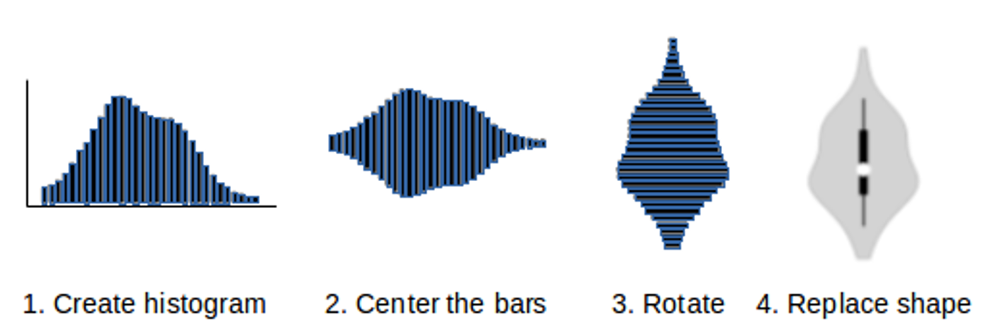
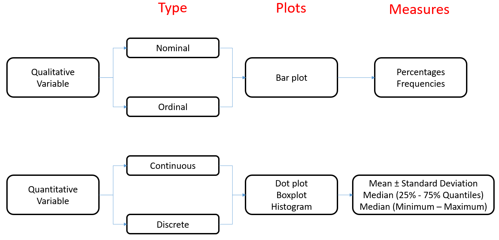

```{r setup, include=FALSE}

library(tidyverse)
library(datasauRus)
library(patchwork)
library(gt)

options(htmltools.dir.version = FALSE)

knitr::opts_chunk$set(
  fig.width=9, fig.height=3.5, 
  fig.retina=3,
  out.width = "100%",
  cache = T,
  echo = F,
  message = FALSE, 
  warning = FALSE,
  fig.show = TRUE,
  hiline = TRUE,
  comment = ''
)


set.seed(2021)
df <- tibble(
  'patient_id' = 1:10,
  # 'sex' = c(rep('M', 5), rep('F', 5)),
  'sex' = sample(c('M', 'F'), 10, replace = 1),
  'age' = sample(30:37, 10, replace = T)
)

```

```{r xaringan-themer, include=FALSE, warning=FALSE}
library(xaringanthemer)

style_duo_accent(
  primary_color = "#1381B0",
  secondary_color = "#FF961C",
  inverse_header_color = "#FFFFFF"
)
```

class: center middle

# Biostatistics

## Descriptive Statistics

Michael Luu, MPH

Biostatistics and Bioinformatics Research Center | Cedars Sinai Medical Center

#### `r Sys.Date() %>% format(., '%B %d, %Y')`

---

class: center middle inverse

# Introduction

---

class:

# What is descriptive statistics?

--

- **Descriptive statistics** is a collection of statistical measures and tools used to give us a better sense of the sampled data

--

- Not to be confused with **inferential statistics** where we are trying to reach
conclusions that extend beyond the sampled data

---

background-image: url(images/sampling_figure.PNG)
background-size: contain

---

# Why descriptive statistics ?

--

- Provides an understanding of the underlying sample population

--

- Simplifies large amounts of data to a simpler summary

--

- Identifies potential measurement errors or mistakes

---
class: center middle

# Types of Data

```{r, out.width = '75%'}
knitr::include_graphics('images/variable_types.png')
```

---

# Types of Data

### Quantitative (Numeric)

Variable that has been measured on a numeric or quantitative scale

--

#### **Continuous** 
  
- Can theoretically take on an infinite number of values - accuracy is limited only by the measuring instrument 
  - e.g. age, BMI, BSA, height, weight, etc..

--

#### **Discrete** 
- Numerical variables that are measured and can only be whole numbers 
  - e.g. age, heart rate, number of medication taken, number of relapses, etc..


---
# Types of Data

### Qualitative (Categorical)

Variables that are typically not directly measured by an instrument, and are based on observations

--

#### **Ordinal** 
- Variables that have an inherent hierarchical order to the relationship among the different categories 
  - e.g. pain scores, stage of cancer, education level, etc..

--

#### **Nominal** 
- Variables that are "named" or classified into one or more qualitative groups
- Do not have a sense of ordering between the different categories
  - e.g. risk factors, types of medications consumed, types of symptoms experienced, surgical outcomes, blood type, gender, etc..

---
# Types of Data

### Why do we need to identify the types of data ? 

--

- In statistics we have specialized tools or measures to handle different type of data 

--

- You will **NEED** to understand what kind of data you have in order to correctly summarize your data

---

class: center middle inverse

# Quantitative Data

---

# Numerical Summarization

--

.pull-left[
### Measures of Location
  - Mean
  
  - Median
  
  - Mode
]

--

.pull-right[
### Measures of Variability or Dispersion
  - Minimum and Maximum
  
  - Percentiles / Interquartile Range (IQR)
  
  - Standard Deviation

]

---

# Measures of Location

### Mean

--

- The sample mean is the most commonly used and readily understood measure of central tendency.

--

- The sample mean can be defined as:

$$\huge \bar{x} = \frac{\sum x_i}{n}$$

---
# Example Data

```{r}
df %>% knitr::kable()
```

---

# Example

We have a collection of **age** that was collected from the sample population

```{r}
df$age
```

--

* The **total sum** of all of the sampled age is `r sum(df$age)`

--

* The **total number of measurements** collected is `r length(df$age)`

--

* The **mean** or average age among the sample population is `r mean(df$age)`

---

# Measures of Location
### Median

--

- The median is the midpoint of the values 

--
  -  The midpoint value is the point at which half the observations are above the value and half the observations are below the value *(50th percentile*). 
  
--

  - If there are two 'middle' values then the median is the average of the two mid values

---

# Example

Let's recall the collection of **age** that we have collected from the sample population

```{r}
df$age
```

--

* We start by ranking the data from smallest to largest 

```{r}
sort(df$age)
```

--

* We identify the **middle** value from the data

```{r}
sort(df$age)[5:6]
```

--

* We then take the average of the two middle value to obtain the **median**

```{r}
median(df$age)
```

---

# Measures of Location
### Mode

--

- The mode is the value that appears most often in a set of values. 

--

- Not always a measure of central tendency

--

- The mode is only useful for discrete values or continuous values with limited digits of accuracy

--

- It's possible to have more than 1 mode

---

# Example

```{r}
df$age
```

- Let's tabulate the occurences of each of the sampled age

--
```{r}
table(df$age)
```

--

- The mode is the value that occured the most often. 

--

- In our example, the mode is **`r table(df$age)[table(df$age) == max(table(df$age))] %>% names()`**

---
# Measures of Variability or Dispersion

### Minimum and Maximum

--

A measure of dispersion and is defined as the smallest and largest value

---
# Example

```{r}
df$age
```

--

- We will rank the data from smallest to largest

--

```{r}
sort(df$age)
```

--

- The min and max corresponds to the smallest and largest values of our sample. 

--

- In our example, the min would be **`r min(df$age)`**, and the max would be **`r max(df$age)`**

---
# Measures of Variability or Dispersion

### Percentiles / Interquartile Range (IQR)

--

- The interquartile range is defined as the range between the 25th and 75th percentiles

$$\LARGE IQR = Q_3 - Q_1$$ 

--

- It is commonly denoted after presenting the median

--

- The interquartile range can be used to describe the spread of the data. As the spread of the data increases, the IQR becomes larger. 

--

- It is also used to build box plots.

--

- Depending on the statistical software you are using, there are multiple ways of calculating quantile

---
# Example

We determine the interquartile range by calculating quantiles at the 25th and the 75th percentile.

```{r}
df$age
```

--

- We begin by sorting the values

```{r}
sort(df$age)
```

--

- The 25th percentile is the value that divides the data where 25 percent falls below this value and 75 percent falls above this value.

--

- The 75th percentile is the value that divides the data where 75 percent falls below this value and 25 percent falls above this value.

--

```{r}
quantile(df$age, type = 6)
```

--

- The interquantile range is the distance between the value of the 75th percentile and the 25th percentile.

--

- In this example, the IQR is **`r quantile(df$age, .75, type = 6) - quantile(df$age, .25, type = 6)`**

---

# Measures of Variability or Dispersion
### Standard Deviation

The standard deviation is a measure of how spread out the data are about the mean. 

$$\LARGE s = \sqrt{\frac{1}{N-1} \sum_{i=1}^N (x_i - \overline{x})^2}$$

---

# Example

.pull-left[

```{r}
df$age
```

- The mean sample age is **`r mean(df$age)`**

- There is a total of **`r length(df$age)`** measurements

]

--

.pull-right[

```{r}
tibble('age' = df$age,
       'mean_age' = mean(df$age)) %>%
  mutate(
    diff = age - mean_age
  ) %>%
  mutate(
    diff2 = (diff)^2
  )
```

]

---
# Example

```{r}
tibble('age' = df$age,
       'mean_age' = mean(df$age)) %>%
  mutate(diff = age - mean_age) %>%
  mutate(diff2 = (diff) ^ 2) %>%
  summarise(summ_diff2 = sum(diff2)) %>%
  mutate(
    total_length_minus_one = length(df$age) - 1,
    var = summ_diff2 / total_length_minus_one,
    sd = sqrt(var)
  )

```

--

The sample standard deviation is **`r sd(df$age) %>% scales::number(., .01)`**

---
# Example 

```{r}

set.seed(1)
tibble(sd = c(2.08, 10, 15)) %>%
  mutate(data = map(sd, ~ rnorm(500, mean = 34, sd = .x))) %>%
  mutate(label = glue::glue('SD: {sd}')) %>%
  mutate(label = as_factor(label)) %>%
  unnest(data) %>%
  ggplot(., aes(x = data)) +
  geom_histogram() +
  facet_grid( ~ label) +
  geom_vline(
    xintercept = 34,
    linetype = 'dashed',
    color = 'red',
    size = 1
  ) +
  theme_bw(base_size = 15) + 
  theme(panel.grid = element_blank()) + 
  labs(x = 'Age', y = 'n', caption = 'Mean: 34')

```


---
# Presenting / Describing your data

--

- You should always include **BOTH** a *measure of central tendency* and *measure of dispersion* when presenting your data

--

- The choice is dependent on the distribution of your data

--

.pull-left[
### Symmetric Distribution

```{r, out.width = '75%', fig.align = 'center'}
set.seed(1)
tibble(x = rnorm(1000, 0)) %>%
  ggplot(aes(x = x)) + 
  geom_histogram() +
  theme_void()
```

- mean ± SD
- median (25%, 75% quantiles)
- median (IQR)
- median (min - max)

]

--

.pull-right[
### Asymmetric Distribution

```{r, out.width = '75%', fig.align = 'center'}
set.seed(1)
tibble(x = rlnorm(1000, 0)) %>%
  ggplot(aes(x = x)) + 
  geom_histogram() +
  theme_void()
```

- median (25%, 75% quantiles)
- median (IQR)
- median (min - max)

]
---

class: middle, center, inverse
# Qualitative Data

---

# Summarizing Qualitative Data

--

- The primary method of summarizing qualitative data is frequency **counts** and **percentages**

```{r}
df$sex

```

--

- Let's tabulate the total occurrences of M and F in our data

```{r}
df %>%
  count(sex)
```

--

- Next we take the total and divide by the total number of patients

```{r}
df %>%
  count(sex) %>%
  mutate(
    proportion = n / sum(n),
    proportion = scales::percent(proportion, .1)
  )
```


---
class: center middle inverse

# Graphical Summarizations

---
class: center middle inverse

# What do the following figures have in common?

---

class: middle center

```{r}
dino_dozen <- \(dataset) {

  plot_data <- datasaurus_dozen %>%
    filter(dataset == {{dataset}})
  
  plot <- ggplot(plot_data, aes(x = x, y = y)) +
    geom_point(size = 1) +
    theme_bw()
  
  table <- plot_data %>%
    summarise(
      mean_x = mean(x),
      mean_y = mean(y),
      sd_x = sd(x),
      sd_y = sd(y),
      corr = cor(x, y)
    ) %>%
    pivot_longer(
      1:ncol(.)
    ) %>%
    rename(
      'Measures' = name,
      'Statistic' = value
    )
  
  list(
    'plot' = plot,
    'tbl' = table
  )
  
}
```

```{r, fig.height = 3, fig.width = 3, out.width='50%', fig.align='center'}
temp <- dino_dozen('dino')

temp$plot
```

---

class: middle center

```{r, fig.height = 3, fig.width = 3, out.width='50%', fig.align='center'}
temp <- dino_dozen('circle')

temp$plot
```

---

class: middle center

```{r, fig.height = 3, fig.width = 3, out.width='50%', fig.align='center'}
temp <- dino_dozen('star')

temp$plot
```

---
class: middle center inverse

# They all have the same summary statistic ...

---

```{r, fig.align='center'}
knitr::include_graphics('images/DinoSequentialSmaller.gif')
```

https://www.autodesk.com/research/publications/same-stats-different-graphs

---
class: center middle inverse

# Quantitative summary measures are useful ...

---
class: center middle inverse

# Graphical summarizations provides an additional perspective

---

# Graphical Summarization

--

## Quantitative Data

- Histograms
- Dot plots
- Box plots

--

## Qualitative Data

- Bar plots

---

# Histogram

.pull-left[

* Useful for all sized data (small and large)

* Allows us to visualize the spread and distribution of continuous variables

* Each bar represents a 'bin' or a defined interval of values

* Although not as common, the width of the bins does NOT have to be equal!

* The y axis or the height of the bar represents the count of the number of values that fall into each bin
  
* The y axis is also commonly normalized to 'relative' frequencies to show the proportion of cases or density that falls into each bin.
]

.pull-right[

```{r, fig.height=5, fig.width=6}

local({
  set.seed(1)
  data <- tibble(x = rnorm(1000, 25, sd = 2))
  
  plot_a <- ggplot(data, aes(x = x)) +
    geom_histogram(color = 'white', binwidth = 1) + 
    labs(y = 'Frequency') + 
    geom_density(aes(y = 1 * ..count..))
  
  plot_b <- ggplot(data, aes(x = x)) +
    geom_histogram(color = 'white', breaks = c(seq(18, 25, 1), 28, 30)) + 
    labs(y = 'Frequency') + 
    scale_x_continuous(breaks = seq(0, 40, 1)) 
  
  plot_a / plot_b
  
})

```

]

---
# Distribution

> "A distribution is simply a collection of data, or scores, on a variable. Usually, these scores are arranged in order from smallest to largest and then they can be presented graphically."

— Page 6, Statistics in Plain English, Third Edition, 2010.

```{r, fig.align='center', fig.width=6, fig.height=4, out.width='50%'}
local({
  set.seed(1)
  data <- tibble(x = rnorm(1000, 25, sd = 2))

  ggplot(data, aes(x = x)) +
    geom_histogram(color = 'white', binwidth = 1) +
    labs(y = 'Frequency') +
    geom_vline(aes(xintercept = mean(x)), color = 'red', size = 1) +
    geom_vline(aes(xintercept = median(x)), color = 'green', size = 1, linetype = 'dashed') + 
    geom_vline(aes(xintercept = 25), color = 'blue', size = 1, linetype = 'dotted') +
    geom_density(aes(y = 1 * ..count..))
})


```

---
# Example (n = 10, binwidth = 1)

```{r}

ggplot(df, aes(x = age)) +
  geom_histogram(binwidth = 1, aes(fill = sex)) +
  geom_vline(
    xintercept = mean(df$age),
    linetype = 'dashed',
    size = 1,
    color = 'red'
  ) +
  theme_bw(base_size = 15) +
  theme(panel.grid = element_blank()) +
  labs(x = 'Age', y = 'n', fill = 'Sex') +
  scale_x_continuous(breaks = 30:40) +
  ggsci::scale_fill_d3()


```

---

# Example (n = 500, binwidth = 1)

```{r}

set.seed(1)

tibble(sex = sample(c('M', 'F'), 500, replace = T),
       age = rnorm(500, 33.9, sd = 5)) %>%
  ggplot(., aes(x = age, fill = sex)) +
  geom_histogram(binwidth = 1) +
  theme_bw(base_size = 15) +
  theme(panel.grid = element_blank()) +
  ggsci::scale_fill_d3() +
  labs(x = 'Age',
       y = 'n',
       fill = 'Sex') +
  geom_vline(
    xintercept = 33.9,
    linetype = 'dashed',
    size = 1,
    color = 'red'
  )

```

---

# Example (n = 500, binwidth = 5)

```{r}

set.seed(1)

tibble(sex = sample(c('M', 'F'), 500, replace = T),
       age = rnorm(500, 33.9, sd = 5)) %>%
  ggplot(., aes(x = age, fill = sex)) +
  geom_histogram(binwidth = 5) +
  theme_bw(base_size = 15) +
  theme(panel.grid = element_blank()) +
  ggsci::scale_fill_d3() +
  labs(x = 'Age',
       y = 'n',
       fill = 'Sex') +
  geom_vline(
    xintercept = 33.9,
    linetype = 'dashed',
    size = 1,
    color = 'red'
  ) + 
  scale_x_continuous(breaks = seq(0, 50, 5))

```

---
# Dot plot 

.pull-left[

* Useful for small to moderate sized data

* Allows us to visualize the spread and distribution of one continuous discrete variables
  * e.g. length of stay

* The X axis is the variable of interest and each dot represents a single observation

* Easy to identify the mode

* Highlights clusters, gaps, and outliers

* Intuitive and easy to understand

]

.pull-right[

```{r, fig.height=4, fig.width=6}

local({
  set.seed(5)
  data <- tibble(x = rnorm(50, 25, sd = 5) %>% round())
  
  ggplot(data, aes(x = x)) +
    geom_dotplot(
      method = 'histodot',
      binwidth = 1,
      dotsize = 1,
      stackratio = 1.1
    ) +
    theme_minimal(base_size = 15) +
    theme(panel.grid.minor = element_blank()) +
    scale_x_continuous(breaks = seq(0, 50, 1)) +
    scale_y_continuous(breaks = NULL) +
    labs(y = NULL)
  
})

```

]

---
# Example

```{r}

ggplot(df, aes(x = age, fill = sex)) + 
  geom_dotplot(binwidth = 1) + 
  scale_x_continuous(breaks = 30:40) + 
  theme_bw(base_size = 15) +
  theme(panel.grid = element_blank(),
        axis.text.y = element_blank(),
        axis.ticks.y = element_blank()) + 
  labs(x = 'Age', y = NULL, fill = "Sex") + 
  ggsci::scale_fill_d3()
```


---
# Box plots

```{r, fig.align='center', out.width = '75%'}
knitr::include_graphics('images/boxplot_explained.png')
```

---

# Example

```{r}
df %>%
  ggplot(., aes(x = sex, y = age, color = sex)) + 
  stat_boxplot(geom = 'errorbar', width = .2, size = 1) +
  geom_boxplot(width = .5, size = 1) + 
  theme_bw(base_size = 15) + 
  labs(x = 'Sex', y = 'Age', color = 'Sex') +
  ggsci::scale_color_d3()
```

---
class: center inverse middle

# Boxplots are not perfect ...

---

# Raw Data vs Box Plot vs Violin Plot

```{r, out.width = '100%', fig.align = 'center'}
knitr::include_graphics('images/BoxViolinSmaller.gif')
```

https://www.autodesk.com/research/publications/same-stats-different-graphs

---

# How are violin plots made?

```{r, out.width='100%', fig.align='center'}



```

* Hintze, J. L., & Nelson, R. D. (1998). Violin plots: a box plot-density trace synergism. The American Statistician, 52(2), 181-184.


---

# Violin plot

.pull-left[

* Violin plots are box plots, with an overlay of the density distribution (histogram) of the data

* More informative than a simple box plot

* Visualizes the full distribution of the data

* Especially useful for bimodal or multimodal distribution
  * e.g. distribution of data with multiple peaks

]

.pull-right[

```{r, fig.height=4, fig.width=6}

set.seed(1)
data <- tibble(
  group = sample(c('A', 'B'), 50, replace = T),
  y = c(rnorm(25, 30, sd = 2), rnorm(25, 45, sd = 2))
)

ggplot(data, aes(x = group, y = y)) +
  geom_boxplot(width = .1, aes(color = group)) +
  geom_violin(aes(fill = group, color = NA), alpha = .2) +
  theme_minimal(base_size = 15) +
  theme(legend.position = 'none',
        axis.text.x = element_text(face = 'bold')) + 
  ggsci::scale_color_d3() + 
  ggsci::scale_fill_d3() +
  labs(x = NULL) + 
  coord_cartesian(expand = T)
```

]

---

# Example

```{r}
df %>%
  ggplot(., aes(x = sex, y = age, color = sex)) +
  stat_boxplot(geom = 'errorbar', width = .05, size = 1) +
  geom_boxplot(width = .05, size = 1) +
  theme_bw(base_size = 15) +
  labs(x = 'Sex', y = 'Age', color = 'Sex', fill = 'Sex') +
  ggsci::scale_color_d3() +
  ggsci::scale_fill_d3() +
  geom_jitter(width = .1, size = 2) +
  geom_violin(aes(fill = sex), alpha = .1, scale = 'width', width = .2, color = NA)
  
```

---
# Bar plot

.pull-left[

* Useful for visualizing **categorical** data

* Commonly used to present counts and proportion of each level

* Allows us to quickly observe the difference in magnitude of each level based on the height of each bar

]

.pull-right[

```{r, fig.height=6, fig.width=6, out.width='100%', fig.align='center'}

local({
  set.seed(1)
  data <- tibble(x = rnorm(25, 25, sd = 5) %>% round(),
                 group = sample(c('A', 'B'), size = 25, replace = T))
  
  plot_data <- data %>%
    group_by(group) %>%
    count() %>%
    ungroup() %>%
    mutate(prop = n / sum(n)) %>%
    mutate(label = glue::glue('{n} ({scales::percent(prop, .1)})'))
  
  plota <- ggplot(plot_data, aes(x = group, y = n, fill = group)) +
    geom_col() +
    theme_minimal(base_size = 15) +
    theme(panel.grid.minor = element_blank(),
          legend.position = 'none',
          axis.text.x = element_text(face = 'bold')) +
    geom_text(
      aes(label = label, y = n / 2),
      hjust = .5,
      size = 5,
      color = 'white',
      fontface = 'bold'
    ) +
    ggsci::scale_fill_d3() + 
    labs(x = NULL, y = 'Frequency')
  
  plotb <- ggplot(plot_data, aes(x = group, y = prop, fill = group)) +
    geom_col() +
    theme_minimal(base_size = 15) +
    theme(
      panel.grid.minor = element_blank(),
      legend.position = 'none',
      axis.text.x = element_text(face = 'bold')
    ) +
    geom_text(
      aes(label = label, y = prop / 2),
      hjust = .5,
      size = 5,
      color = 'white',
      fontface = 'bold'
    ) +
    ggsci::scale_fill_d3() +
    labs(x = NULL, y = 'Proportion (%)') + 
    coord_cartesian(ylim = c(0, 1)) + 
    scale_y_continuous(labels = scales::percent)
  
  plota / plotb
  
})

```

]

---
# Bar plot

```{r}
df %>%
  group_by(sex) %>%
  count() %>%
  ungroup() %>%
  mutate(prop = n / sum(n)) %>%
  ggplot(., aes(x = sex, y = n)) + 
  geom_col() + 
  theme_bw(base_size = 15)+ 
  labs(x = 'Sex', y = 'Frequency') + 
  geom_text(aes(label = scales::percent(prop, .1), y = n / 2), color = 'white', fontface = 'bold', size = 10)

```

---
# Bar plot

```{r}
df %>%
  group_by(sex) %>%
  count() %>%
  ungroup() %>%
  mutate(prop = n / sum(n)) %>%
  ggplot(., aes(x = sex, y = prop)) + 
  geom_col() + 
  theme_bw(base_size = 15)+ 
  labs(x = 'Sex', y = 'Percent (%)') + 
  geom_text(aes(label = n, y = prop / 2), color = 'white', fontface = 'bold', size = 10) + 
  scale_y_continuous(labels = scales::percent_format())

```

---
class: middle, center, inverse

# Summary

---
# Summary

```{r, out.width='75%', fig.align='center'}

```

---
class: middle, center, inverse

# Questions

